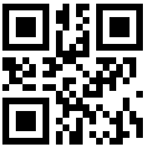

# Intigriti CTF

## The challenge



## The solution

### Step 1

When I saw the tweet I immediately went looking for hidden characters in the tweet.  
After some time I found out that that wasn't going to be it, so I downloaded the image on my phone \(I was on the train going home\).  
When I looked inside the image I saw a lot of `A`\`s so I started looking further.  
Then there were different file headers, so I tried removing everything before the `A`'s and making it a different file.  
All of this was very difficult on my phone but when I finally arrived home, I took my laptop and used an icc file extractor.  
Again no luck...  
Then I used binwalk and got the PDF!  
The PDF said:  
`aHR0cHM6Ly9nby5pbnRpZ3JpdGkuY29tLzA3YjBmTDI0bGttdmE=`  
Source for this cool technique:



I instantly saw that was base64 and decoded it only to find an URL for the next step:



### Step 2

So now I have a password-protected zip and I need a password.  
After a lot of guessing and a good night sleep, I found out I didn't test the banner of the twitter account I found in the tweet.

On mobile: copy the tweet and paste it to find a twitter account URL:



So I wanted to download the banner and I inspect the element on twitter only to find that the password is there!



### Step 3

So my friend was looking through the zip before I got the password and he told me that there were black and white images and that he tried morse and binairy without success.  
I told him that it might be a square of images \(got the tip "the answer is in the matrix"\).  
Then when I got the password I wrote this php script:

```text
<?php
for ($i=1; $i < 442; $i++) {
  echo "";
  if ($i % 21 == 0) {
    echo "<br>";
  }
}
?>
```

I removed the first '0' from the images 1\_01 through 1\_09.  
When you use the scripts it generates a nice qr-code!



### FLAG

When scanned you see this:  
`flag:YOUWINTIGRITI`
