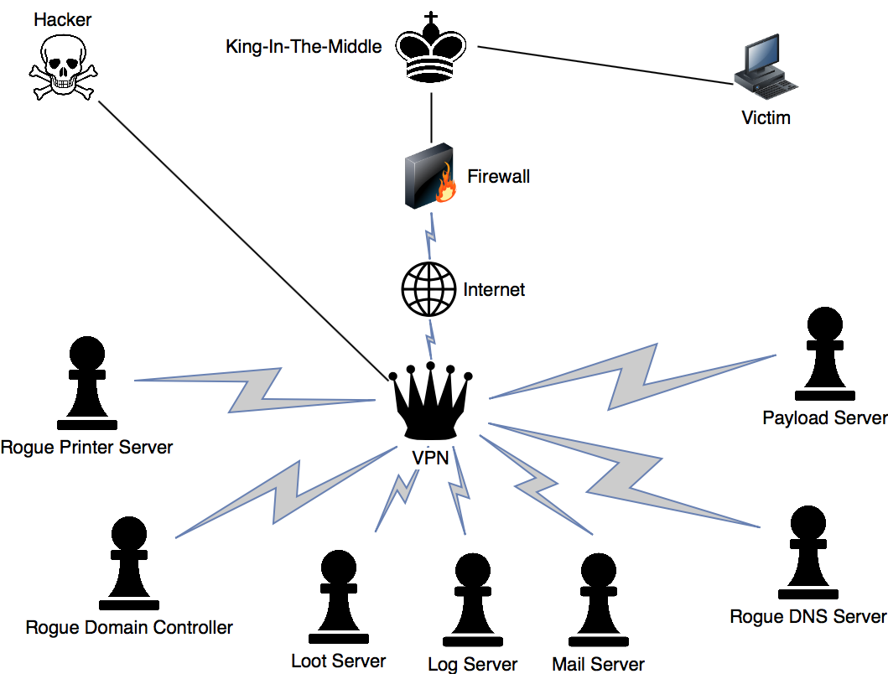

# King In The Middle Attack

## Overview

### Technical implementation



## King

> This is the instance that will connect the victim to the King-in-the-Middle network. This can be wathever you want but in this article I will assume it is a normal Linux machine.

The King is the centerpiece of this setup \(kind of like in chess, because it is one hop away from everything\).

The trick with King-In-The-Middle is that you take the network to the victim, meaning that instead of taking over the network, you spoof it. This can be used to bypass firewalls, gain initial access ...

This can be done by physically placing the King in place \(e.g. a WiFiPinapple being installed as a Rogue AP\) or by PWNing a victim on the network remotely.

### Examples of a King Device

> P stands for Physical access and R stands for Remote access.

* Raspberry pi \(P\)
* WiFiPinapple \(P\)
* Via BashBunny or LanTurtle as an Ethernet Adaptor \(P\)
* Service on a victim \(R\)
* Gain access to Firewall \(R\)

## Firewall

> This is placed so malicious content won't leave the infected network.And it can also be used to stay undetected using reverse connections.

## VPN

> The VPN is designed to be interchangable, it can easily change IP, mac adresses ... This is in case the network is burnt.

## Payload Server

> A place to put all the payloads, be it phishing websites, executables, malware ... This is connected to the VPN network so you can easily upload and access the files.

## Rogue DNS server

> Used for phishing, this will spoof adresses to the payload server so the victim thinks he's on the right server but is connected to the payload server.

This will enhance the stealth of our phishing attacks. If for example we use the payloads server to serve phishing sites, we can mask the directories with real hostnames: 


## `Example config`

`127.0.0.1 facebook.com google.com`



Due to HSTS some sites may not be spoofable


## Internet Connection

> After everything is logged and spoofed, the victim gets an internet connection so everything works without raising suspision.

## Log Server

> Everything that passes through the VPN will be logged here. A log parses such as SPLUNK can be used to browse through the logs efficiently.

## Loot Server

> All Credentials, files and other information that is gained fro the victim will be stored here.

## Mail Server

> This can be used to send mail traffic from the victim to the hacker before sending it to the intended person.

## Rogue Domain Controller

> This can be used as a spoofed ADDC so the victim will connect and credentials can be stolen / repeated. Requests from the victim can then be redirected to the real DC so everything continues to work.

## Rogue Printer Server

> Print requests can be intercepted, sent to the loot server and then redirected to the real server.

