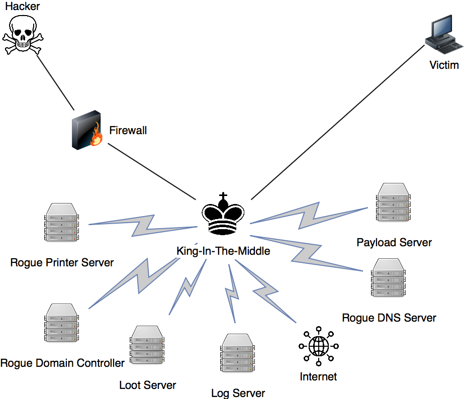

# King In The Middle Attack

## Overview

## King

> This is the instance that will connect the victim to the King-in-the-Middle network. This can be wathever you want but in this article I will assume it is a normal Linux machine.

### Overview

> The King is the centerpiece of this setup \(kind of like in chess, because it is one hop away from everything\).

## DNS server

## Payload Server

## 

