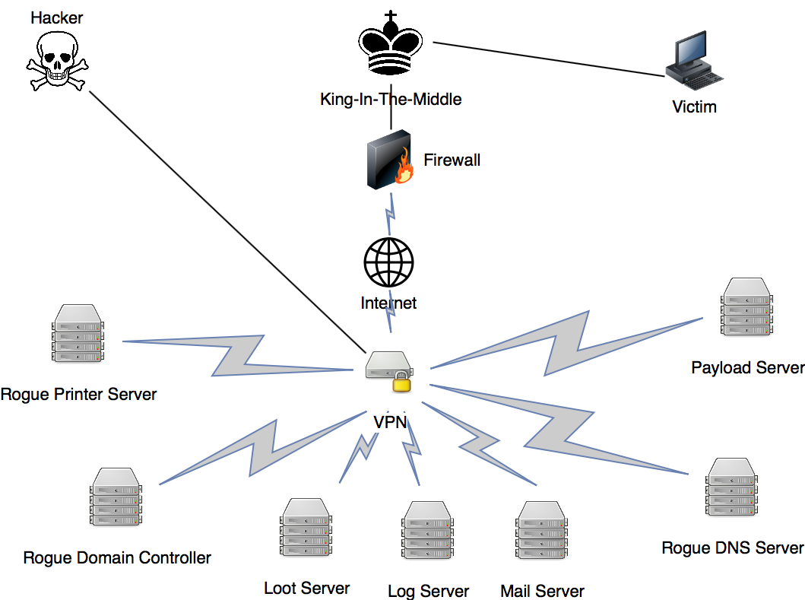

# King In The Middle Attack

## Overview

## King

> This is the instance that will connect the victim to the King-in-the-Middle network. This can be wathever you want but in this article I will assume it is a normal Linux machine.

> The King is the centerpiece of this setup \(kind of like in chess, because it is one hop away from everything\).

## Firewall

> This is placed so malicious content won't leave the infected network.And it can also be used to stay undetected using reverse connections.

## VPN

> The VPN is designed to be interchangable, it can easily change IP, mac adresses ... This is in case the network is burnt.

## Payload Server

> A place to put all the payloads, be it phishing websites, executables, malware ... This is connected to the VPN network so you can easily upload and access the files.

## Rogue DNS server

## Internet Connection

## Log Server

## Loot Server

## Mail Server

## Rogue Domain Controller

## Rogue Printer Server

